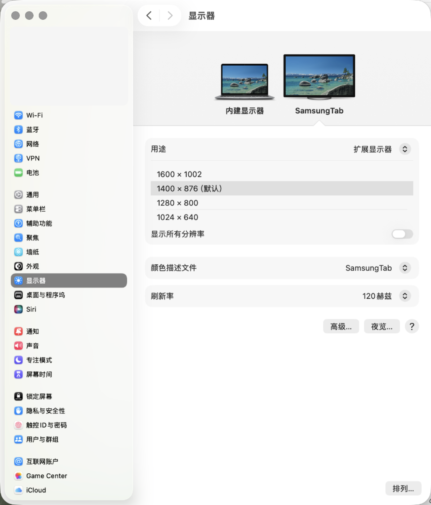
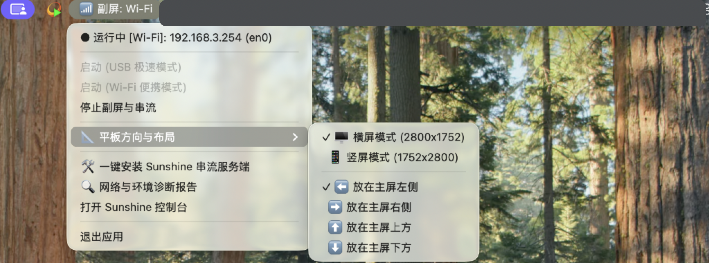
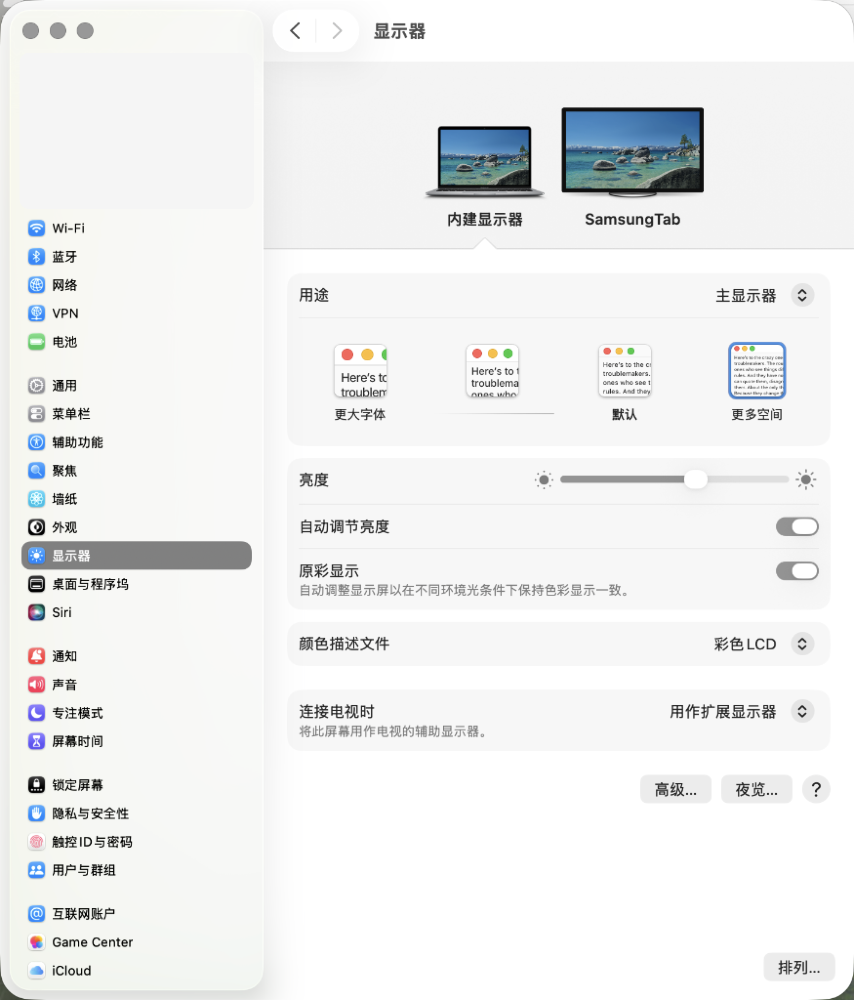
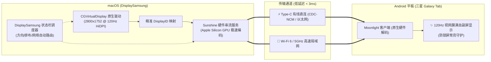

<div align="center">

# 📱 DisplaySamsung

### 将你的三星 / Android 平板，化身为 Mac 的 120Hz 极速视网膜高刷扩展屏！

[](https://github.com/hequanwei/DisplaySamsung)
[](https://github.com/hequanwei/DisplaySamsung)
[](https://github.com/hequanwei/DisplaySamsung/releases)
[](https://github.com/hequanwei/DisplaySamsung)
[](https://github.com/hequanwei/DisplaySamsung)
[](LICENSE)

<br />

**DisplaySamsung** 是一款专为 **macOS** 与 **Android 平板**（深度优化三星 Galaxy Tab S7+ / S8+ / S9+ / S10 系列等 2800x1752 顶级 AMOLED 屏）打造的轻量级状态栏自动化调度器。<br/>
通过内置原生虚拟显示器内核驱动与 Sunshine / Moonlight 极速串流，提供超越苹果原生 Sidecar 的 **120Hz 极致视网膜高刷、低至 2ms 延迟、支持横竖屏即时热切换、Type-C 有线/无线双模直连** 的非凡体验！

<br />

[✨ 核心特性](#-核心特性) •
[📷 实测预览](#-实测预览) •
[🆚 方案对比](#-为什么选择-displaysamsung) •
[🚀 30秒极速上手](#-30秒极速上手-新手-1-2-3) •
[⚡ Type-C 有线模式](#-type-c-数据线直连极速模式) •
[🛡️ 防黑屏与滑动锁指南](#-彻底解决平板黑屏与滑动锁问题) •
[💡 FAQ 避坑指南](#-常见问题与避坑指南-faq)

<br />

</div>

---

## 📷 实测预览

| 🖥️ 120Hz 视网膜高刷原生激活 | 📐 状态栏菜单与横竖屏/排布秒切 |
| :---: | :---: |
|  |  |

<p align="center">
  
  <br />
  <em>macOS 系统原生扩展识别：主屏 + 三星平板无缝双屏空间排布</em>
</p>

---

## ✨ 核心特性

- ⚡ **原生 120Hz 满血高刷 & 2800x1752 HiDPI Retina**
  - 内置基于 macOS 私有 `CGVirtualDisplay` API 编写的原生驱动，直接激活 **120 赫兹** 原生超高刷新率，杜绝 60Hz 拖影，丝滑跟手。
- 📐 **平板方向与空间布局即时热切换**
  - **横竖屏一键旋转**：随时在 **🖥️ 横屏 (2800x1752)** 与 **📱 竖屏 (1752x2800)** 之间无缝热切换，看长文档、刷 GitHub、写代码、审阅 PDF 绝配！
  - **空间排布自由选择**：副屏放置在 Mac 的 **左侧、右侧、上方、下方**，点击秒级生效，实时改变鼠标穿屏方向。
- 🔌 **双模支持：Type-C 有线极速直连 + Wi-Fi 便携无线**
  - **Type-C 有线直连**：抗干扰强、延迟逼近 0ms，同时为平板满血供电；
  - **Wi-Fi 便携模式**：5GHz 局域网下延迟仅 2~4ms，桌面无线无拘无束。
- 🛡️ **针对三星 One UI 独家优化：防锁屏与常亮卫士**
  - 彻底破解三星 Game Booster（游戏助推器）在挂机 3 分钟后出现的“触摸保护滑动锁”与黑屏问题，副屏长久保持常亮不中断。
- 🚫 **100% 杜绝幽灵屏幕残留**
  - 深度监听退出事件、快捷停止与系统 POSIX 信号，停止即刻完全注销虚拟屏，不留黑屏残影，不干扰主屏分辨率。
- 📦 **免配 Python 环境，DMG 拖拽开箱即用**
  - 独立封装为 11MB 超轻量 `.dmg` 安装包，原生驻留 macOS 顶部菜单栏，无任何 Dock 干扰。

---

## 🆚 为什么选择 DisplaySamsung？

| 功能维度 | 📱 **DisplaySamsung** (本方案) | 🍏 Apple 原生 Sidecar | 💸 Duet Display / Yam | 🌐 Deskreen / 网页投屏 |
| :--- | :---: | :---: | :---: | :---: |
| **Android / 三星平板支持** | **完美支持 (专属适配)** | ❌ 仅限 iPad | ⚠️ 支持有限 / 需安装繁琐驱动 | ⚠️ 仅浏览器窗口 |
| **刷新率** | **⚡ 120Hz 满血高刷** | 60Hz (部分 Pro 支持 ProMotion) | 60Hz (120Hz 需昂贵订阅) | 30Hz ~ 60Hz (卡顿明显) |
| **显示质量** | **2800x1752 原生 HiDPI** | 原生视网膜 | 压缩失真明显 | 网页重压缩，文字发虚 |
| **横竖屏热切换** | **✅ 状态栏秒切** | 需物理旋转且易卡顿 | 需手动修改分辨率 | ❌ 不支持 |
| **连接延迟** | **⚡ 2 ~ 4 ms (接近无感)** | ~ 15 ms | 20 ~ 50 ms | > 100 ms |
| **费用与开源** | **💯 100% 开源免费** | 免费 (但需全套 Apple 硬件) | 每年按期高额收费 | 部分开源 |

---

## 🚀 30秒极速上手 (新手 1-2-3)

### 第一步：Mac 安装 DisplaySamsung
1. 从 [Releases 页面](https://github.com/hequanwei/DisplaySamsung/releases) 下载最新的 **`DisplaySamsung-Installer.dmg`**；
2. 双击打开，将 **DisplaySamsung** 拖入 **Applications**（应用程序）文件夹；
3. 打开启动台启动应用，屏幕右上角菜单栏将出现 `📱 副屏: 闲置` 图标。

### 第二步：授予 Mac 屏幕录制权限（仅需 1 次）
> [!IMPORTANT]
> **必须授权，否则画面无法被 Sunshine 捕获推流（会黑屏）！**
> 打开 Mac **【系统设置】 -> 【隐私与安全性】 -> 【屏幕与系统音频录制】**，确保 **`Sunshine.app`**（以及 DisplaySamsung）开关处于 **开启（蓝色）** 状态。

### 第三步：平板配对连接（仅需首次配对，10 秒搞定）
1. **平板端**：从应用市场或官网下载免费开源的 **[Moonlight Game Streaming](https://moonlight-stream.org/)**；
2. **Mac 端启动**：点击菜单栏图标，选择 **「启动 (Wi-Fi 便携模式)」** 或 **「启动 (USB 极速模式)」**；
3. **配对**：
   - 打开平板端 Moonlight，点击已搜索到的 Mac 图标（或点击右上角手动输入 Mac IP）；
   - 平板屏幕上将出现一个 **4 位数字 PIN 码**；
   - 点击 Mac 菜单栏中的 **「打开 Sunshine 控制台」**，在网页顶部点击 **「PIN」**，输入这 4 位数字并确认，配对即永久完成！
4. **连接**：平板端点击 **Desktop** 桌面图标，立刻进入 120Hz 极致副屏！

---

---

## ⚡ 模式 1：Type-C 数据线纯有线直连 (纯 ADB 映射 / 零 VPN 冲突)

> [!TIP]
> **技术升级**：彻底告别 macOS 缺失 RNDIS 驱动的断层！采用纯 ADB 原生反向端口映射，**主机全托管，平板零负担、零 VPN 开销，绝不影响平板原有的 Clash / 科学上网代理！**

1. **连接数据线**：使用支持数据传输的 Type-C 线连接 Mac 与三星平板；
2. **开启平板 USB 调试**（仅需首次）：
   - 进入三星平板 **【系统设置】->【开发者选项】-> 开启【USB 调试】**；
   - （若未开启开发者选项：在【系统设置】->【关于平板】->【软件信息】连续点 7 次【版本号】即可激活）；
3. **平板屏幕授权**：平板弹出“是否允许 USB 调试”时，勾选 **【始终允许】** 并点击 **【允许】**；
4. **Mac 启动**：点击 Mac 菜单栏 **「⚡ 启动 (Type-C 有线直连模式)」**，调度器将秒级完成端口映射并自动下发充电防黑屏常亮指令；
5. **平板连接**：平板打开 Moonlight，点击右上角【+】号，输入 **`127.0.0.1`** 即可秒级进入 0 延迟、120Hz 极速副屏！

---

## 🌐 模式 2：Mac 独立 5GHz 便携热点模式 (差旅酒店神器)

若你在酒店、高铁或户外，没有优质 Wi-Fi 或遇到酒店 Wi-Fi 开启了「AP 隔离」（禁止设备间局域网互通）：

1. **开启 Mac 共享热点**：在 Mac **【系统设置】->【通用】->【共享】-> 开启【互联网共享】**（向导见菜单栏快捷指引）；
2. **平板连入热点**：三星平板 Wi-Fi 搜索并连上 Mac 发射的专属 5GHz 热点（距离半米，信号 100% 满格）；
3. **Mac 启动**：点击 Mac 菜单栏 **「🌐 启动 (Mac 便携热点模式)」**；
4. **平板连接**：平板 Moonlight 中输入分配的网关 IP（通常为 `192.168.2.1`），享受脱机无干扰的极致副屏体验！

---

## 🛡️ 彻底解决平板黑屏与滑动锁问题

> [!TIP]
> **现象**：副屏使用 3 分钟后，平板屏幕变暗并显示一个“锁头”图标，提示需要手动拖动锁按钮解锁。

### 为什么会出现这个问题？
这是由于三星 One UI 系统的 **游戏助推器（Game Booster）** 默认将 Moonlight 判定为游戏应用。当副屏由 Mac 键鼠操作时，平板表面没有任何手指触碰，三星游戏助推器判定为“挂机”，从而自动激活了 **「触摸保护锁（Touch Protection）」** 并调暗屏幕。

### 彻底根治方案（任选一种，推荐方案一）：

#### ★ 方案一：关闭游戏助推器触摸保护（永久根治，10秒搞定！）
1. 平板打开 Moonlight 进入副屏界面；
2. 从平板屏幕右侧或底部边缘向内滑动，唤出系统导航栏；
3. 点击角落出现的 **🎮 游戏助推器** 图标；
4. 点击右上角 **⚙️ 齿轮（设置）**；
5. 找到 **【触摸保护超时】**，将其更改为 **【从不】**；
6. 同时将 **【自动屏幕锁定】** 开关关闭。

#### ★ 方案二：开启平板“充电时保持屏幕常亮”
1. 进入平板 **【系统设置】->【开发者选项】**；
2. 开启 **【不锁定屏幕（充电时屏幕不休眠）】**；
3. 当使用 Type-C 线直连 Mac 时，平板始终处于供电状态，屏幕将永不息屏、永不锁屏！

#### ★ 方案三：Moonlight 防休眠开关
在平板 Moonlight 主页右上角点击 **⚙️ 设置** -> 勾选 **【Keep display awake】（保持屏幕常亮）**。

---

## 💡 常见问题与避坑指南 (FAQ)

<details>
<summary><b>Q1：为什么连接后平板屏幕上只有壁纸，看不到 Mac 上打开的软件？</b></summary>

* **这是 macOS 的标准“扩展副屏”机制**：
  * 副屏生成后是一块**全新干净的独立工作区**，默认不会堆放主屏幕现存的窗口；
  * **操作方式**：将鼠标光标往 Mac 屏幕右侧（或你在菜单中设置的方向）一直滑动，光标就会顺滑滑入平板；把 Mac 主屏幕上的任意窗口（如浏览器、代码编辑器、文档）**往边框拖拽**，窗口就会进入平板屏幕中！
</details>

<details>
<summary><b>Q2：为什么屏幕分辨率显示 1400x876？</b></summary>

* **这是 macOS 经典的 Retina 视网膜双倍点阵渲染机制**：
  * 物理硬件渲染依然是 **2800x1752 满血输出**，但 UI 缩放为 1400x876 逻辑点阵，以确保文字和图标大小最舒适、细腻不费眼。
  * 若你需要原生点对点：打开 Mac **【系统设置】->【显示器】** -> 选中 **【SamsungTab】** -> 打开 **【显示所有分辨率】**，即可直接选择 `2800x1752` 原生模式。
</details>

<details>
<summary><b>Q3：如何切换为竖屏模式？</b></summary>

* 点击菜单栏图标 -> 展开 **「📐 平板方向与布局」** -> 点击 **「📱 竖屏模式 (1752x2800)」**；
* 调度器会自动重载虚拟分辨率，平板画面秒级同步旋转为竖屏！
</details>

<details>
<summary><b>Q4：如何保证 120Hz 满血生效？</b></summary>

1. 平板端 Moonlight 设置中：将 **Frame Rate** 设置为 **120 FPS**；
2. Mac 端：打开系统设置 -> 显示器 -> 选中 SamsungTab，确认刷新率选择为 **120 赫兹**。
</details>

---

## 🏗️ 架构与技术原理



---

## 🛠️ 本地开发与重新打包

```bash
# 1. 克隆代码仓库
git clone https://github.com/hequanwei/DisplaySamsung.git
cd DisplaySamsung

# 2. 源码本地调试运行
./run.sh

# 3. 运行全套自动化测试
source .venv/bin/activate
python test_suite.py

# 4. 一键重新编译打包生成 DMG
./build_dmg.sh
```

---

## 📄 开源许可证

本项目基于 [MIT License](LICENSE) 开源。欢迎 Star、Fork、提交 PR 或 Issue！
